# Sylvio Faneva Randrianarisata

**Systems & backend engineer — C, C++, Linux, networking.**
Antananarivo, Madagascar · UTC+3 · available for remote contract or full-time work.

---

**[Portfolio →](https://claude.ai/code/artifact/216d894b-cdc6-4d02-83be-3cb3d6c85f2c)** — the same
work written up properly, with my push_swap replaying its own instruction stream and my FdF renderer
compiled to WebAssembly and running in the page.

I completed the full Common Core at **42 Antananarivo**, where the curriculum bans frameworks and
external libraries. You do not import the thing — you write it. So I have built, from nothing but the
standard library and the system calls underneath it:

| Project | What it is |
| --- | --- |
| **[webserv](https://github.com/SylvioRand/webserv)** | An HTTP/1.1 web server in C++98 — single-threaded non-blocking event loop over `poll()`, virtual hosts, chunked transfer, file uploads, CGI execution, and an NGINX-inspired configuration parser. |
| **[minishell](https://github.com/SylvioRand/minishell)** | A working Unix shell in C — hand-written lexer and parser for quotes, redirections, heredocs and arbitrary-length pipelines, with bash-accurate signal handling and exit statuses. |
| **[push_swap](https://github.com/SylvioRand/push_swap)** | Sorting a stack through eleven permitted instructions, optimised for the fewest operations — my own cost model rather than a borrowed algorithm. A median of 3 853 operations on 500 values, where full marks stop at 5 500. |
| **[FdF](https://github.com/SylvioRand/fdf)** | A 3D wireframe renderer in C — hand-written Bresenham rasterisation, transformation matrices, isometric and front projections, live rotation and zoom. MiniLibX gives me one pixel; everything between a text file and a picture is mine. |
| **[CASA](https://github.com/SylvioRand/ft_transcendence-42)** | My capstone, built by a team of five where I was tech lead: a property marketplace for the Malagasy market — land, houses and apartments to buy, sell or rent — with AI tooling that lets a buyer describe what they want in their own words instead of filling in a filter form. I owned `services/listings`, the service the product exists for. **243 of the 953 commits are mine**, second of five contributors. |
| **[Inception](https://github.com/SylvioRand/inception)** | Docker infrastructure built from base images only — NGINX terminating TLS 1.2/1.3, WordPress on PHP-FPM, MariaDB, dedicated network, persistent volumes. |
| **[Philosophers](https://github.com/SylvioRand/philosophers)** | Concurrency under tight timing: POSIX threads and mutexes, no data race, no deadlock, no starvation. |

*webserv, minishell and CASA are team projects at 42; my contribution is described in each
repository's README.*

### Five ranked exams, passed

A 42 exam is taken alone, on the clock, with no internet, no notes and no help, and is graded by a test
harness that either accepts your program or does not. **The pass mark is 100** — anything under it is
not a lower grade, it is a fail, so every 100 below is a pass rather than a distinction. There is no
partial credit and no argument.

`Rank 02` · `Rank 03` · `Rank 04` · `Rank 05` · `Rank 06`

What separates a transcript is the projects, where 100 is where you are *allowed* to stop and 125 means
the optional bonus was built and defended as well. I have ten at 125.

---

### What I am building now

**Archit** — a SaaS I have been building alone since March 2026. Anyone can generate code in minutes
now, and every one of those tools improvises the architecture as it goes: fine for a weekend, ruinous
at month six. Archit structures the project *before* generation, then exports that structure into the
language each tool speaks. Five months in: 503 commits, 77k lines of code, 45k lines of documentation,
and **96 numbered architecture decision records**, under a rule that when one changes, every dependent
document changes in the same commit.

The repository is private while it is a commercial product. Happy to walk through the architecture.

### Built for someone else

**[info-connectee](https://github.com/SylvioRand/info-connectee)** — a digital newspaper written by a
class of ten-year-olds. A primary-school teacher described what she wanted her pupils to be able to do;
turning that into technical decisions was the whole job. I chose Hugo deliberately and against my own
preferences: a static site means free hosting, no database to administer, no dependency to patch, and
articles that live in markdown files the teachers edit themselves. It has been running through a school
year without me.

I also work with AI-assisted development day to day: spec-driven development, context engineering, and
building the tooling agents run on rather than just consuming it.

### Foundations, kept private on purpose

The early exercises the curriculum is built on — reimplementing parts of the C standard library,
`printf` and its variadic parsing, buffered line reading, bit-level IPC over UNIX signals, and the
C++98 modules covering OOP, templates, containers and the STL — are **private on purpose**, so that
current 42 students cannot lift them as ready-made solutions. Happy to share them on request.

### Working with

`C` · `C++98/11` · `TypeScript` · `Python` · `Bash` · `Docker` · `NGINX` · `Linux (Debian, Rocky)` ·
`Git` · `GDB` · `valgrind`

Sockets and non-blocking I/O, POSIX processes and threads, memory management without a garbage
collector, HTTP internals, TLS termination, and the kind of debugging where the bug is three layers
below the language.

---

<picture>
  <source media="(max-width: 520px)" srcset="assets/card-narrow.svg">
  
</picture>

### Reach me

Native French and Malagasy, professional English. UTC+3 gives a full working-day overlap with Europe
and a solid morning overlap with US eastern time.

**randrianarisatasylvio@gmail.com**

I am glad to take a paid trial task so you can judge the work directly rather than take my word for it.
